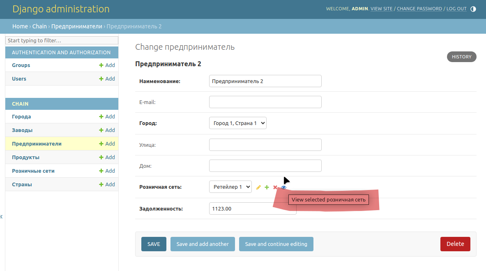
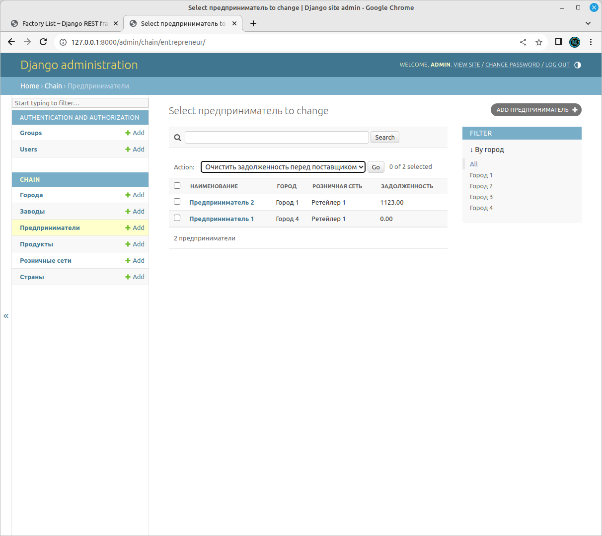

# Решение задания по аттестации

## Проектирование

### Требования (скопировано из [задания](https://my.sky.pro/student-cabinet/stream-module/15772/attestation/materials)):
1. Технические требования:
    - Python 3.8+
    - Django 3+
    - DRF 3.10+
    - PostgreSQL 10+
    - При выполнении тестового задания вы можете дополнительно использовать любые сторонние
      Python библиотеки, без всяких ограничений.

1. Требования к реализации:
    1. Необходимо реализовать модель сети по продаже электроники.
       Сеть должна представлять собой иерархическую структуру из 3 уровней:
       - Завод;
       - Розничная сеть;
       - Индивидуальный предприниматель.
    1. Каждое звено сети ссылается только на одного поставщика оборудования
       (не обязательно предыдущего по иерархии).
    1. Важно отметить, что уровень иерархии определяется не названием звена,
       а отношением к остальным элементам сети, т.е. завод всегда находится на 0 уровне,
       а если розничная сеть относится напрямую к заводу, минуя остальные звенья - её уровень - 1.
    1. Каждое звено сети должно обладать следующими элементами:
       - Название;
       - Контакты:
         - Email;
         - Страна;
         - Город;
         - Улица;
         - Номер дома;
       - Продукты:
         - Название;
         - Модель;
         - Дата выхода продукта на рынок;
       - Поставщик (предыдущий по иерархии объект сети);
       - Задолженность перед поставщиком в денежном выражении с точностью до копеек;
       - Время создания (заполняется автоматически при создании). 

    1. Сделать вывод в админ-панели созданных объектов
       На странице объекта сети добавить:
       - ссылку на «Поставщика»;
       - фильтр по названию города;
       - «admin action», очищающий задолженность перед поставщиком у выбранных объектов.

    1. Используя DRF, создать набор представлений:
       - CRUD для модели поставщика (запретить обновление через API поля
         «Задолженность перед поставщиком»);

    1. Добавить возможность фильтрации объектов по определенной стране.
    1. Настроить права доступа к API так, чтобы только активные сотрудники имели доступ к API.
   
### Предложенное решение

Основным вопросом здесь является правильное создание моделей.
Из предложенных требований просматривается противоречние. А именно, требования:

  - Каждое звено сети ссылается только на одного поставщика оборудования
    (не обязательно предыдущего по иерархии)

и

  - уровень иерархии определяется не названием звена,
    а отношением к остальным элементам сети
    (завод всегда находится на 0 уровне,
    а если розничная сеть относится напрямую к заводу,
    минуя остальные звенья - её уровень - 1)

противоречат друг другу, так как если на поставщика кто-то ссылается,
то из второго утверждения следует, что он обязательно является предыдущим по иерархии,
а значит первое неверно.
 
Поэтому мы его для ясности перепишем так: 
  - Каждое звено сети ссылается только на одного поставщика оборудования
    ~~(не обязательно предыдущего по иерархии)~~**

Таким образом, получается, что если звено цепи ни на кого не ссылается, значит он является
поставщиком 0-го уровня, или "заводом". Остальные звенья должны ссылаться только на одного
поставщика верхнего уровня (на "завод") или на поставщика 1-го уровня,
так как уровней может быть только 3: нулевой, первый и второй.

Следовательно, мы имеем древовидную структуру из 3х уровней, которая может быть представлена в
виде 3х моделей:
  - Завод;
  - Розничная сеть, которая имеет отношение многие к одному заводу;
  - Частный предприниматель, который имеет отношение многие к одному к розничной сети.

Реализованные модели находятся в файле [chain/models.py](chain/models.py)

В стандартную django админ-панель добавлены возможности (отмечено красным):

  - ссылка на «Поставщика»;

  - фильтр по названию города;
  - «admin action», очищающая задолженность перед поставщиком у выбранных объектов.

   
